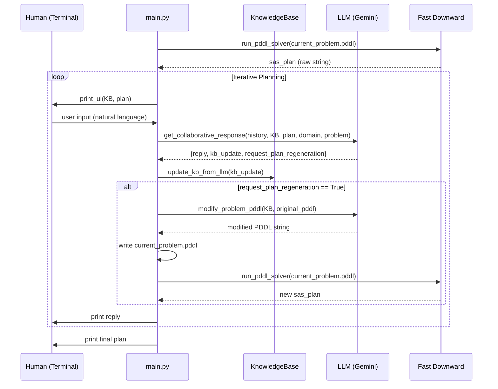
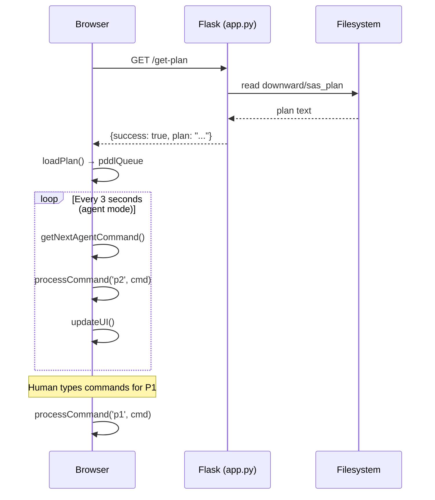

# Codebase Knowledge: LLM-Mediated Task Planner for HRC

> **Self-Contained Reference** — Sufficient to implement features, fix bugs, and refactor safely without repo access.

---

## Table of Contents

1. [High-Level Overview](#1-high-level-overview)
2. [System Architecture](#2-system-architecture)
3. [Feature-by-Feature Analysis](#3-feature-by-feature-analysis)
4. [Data Flow](#4-data-flow)
5. [PDDL Domain Reference](#5-pddl-domain-reference)
6. [LLM Engine Reference](#6-llm-engine-reference)
7. [Web Simulator Reference](#7-web-simulator-reference)
8. [Nuances, Subtleties & Gotchas](#8-nuances-subtleties--gotchas)
9. [Technical Reference & Glossary](#9-technical-reference--glossary)

---

## 1. High-Level Overview

### What Is This System?

This is a **research prototype** implementing an **LLM-mediated human-robot collaboration (HRC) task planner** in a text-based cooking environment. It demonstrates how natural language conversation with an LLM can dynamically update a formal AI planning representation (PDDL) so that a robot agent adapts its task plan to human constraints and preferences in real time.

### Target Domain

A **collaborative sandwich-making task** shared between a human (P1) and a robot (P2) across two rooms (kitchen, pantry). The domain is deliberately simple to isolate the HRC planning mechanics.

### Two-Phase Execution

The system is intentionally split into two sequential programs:

| Phase | Program | Purpose |
|---|---|---|
| **1 – Planning** | `main.py` | Terminal-based conversation loop. Human expresses constraints; LLM updates PDDL; solver regenerates plan. |
| **2 – Simulation** | `app.py` + `templates/index.html` | Flask web server + browser game. Robot executes the PDDL plan; human plays manually. |

### Business/Research Purpose

- Demonstrate that LLMs can serve as a **natural language interface to formal planners**.
- Study how **human preferences and limitations** (allergies, physical constraints, environmental factors) can be expressed conversationally and automatically translated into plan modifications.
- Provide a **playable simulation** to observe HRC plan execution in an interactive environment.

---

## 2. System Architecture

### Component Map

```
┌─────────────────────────────────────────────────────────────────┐
│                        PHASE 1: PLANNING                        │
│                                                                 │
│  Human (Terminal)                                               │
│       │                                                         │
│       ▼                                                         │
│  main.py  ──────────────────────────────────────────────────┐  │
│   │  get_collaborative_response()                           │  │
│   │         │                                               │  │
│   │         ▼                                               │  │
│   │  llm_engine_gemini.py  (or llm_engine_groq.py)         │  │
│   │   ├── get_collaborative_response()  → JSON reply +      │  │
│   │   │     kb_update + request_plan_regeneration           │  │
│   │   └── modify_problem_pddl()        → modified PDDL      │  │
│   │                                                         │  │
│   │  KnowledgeBase (knowledge_base.py)                      │  │
│   │   └── 4 categories: preference, human_limit,            │  │
│   │        robot_limit, environmental                       │  │
│   │                                                         │  │
│   │  Fast Downward Solver (downward/ submodule)             │  │
│   │   └── ./fast-downward.py domain.pddl current_problem.pddl│  │
│   │         → downward/sas_plan                             │  │
│   └─────────────────────────────────────────────────────────┘  │
│                                                                 │
│  Output: downward/sas_plan  (PDDL action sequence)             │
└─────────────────────────────────────────────────────────────────┘

┌─────────────────────────────────────────────────────────────────┐
│                      PHASE 2: SIMULATION                        │
│                                                                 │
│  app.py (Flask)                                                 │
│   ├── GET /          → templates/index.html                     │
│   └── GET /get-plan  → reads downward/sas_plan → JSON           │
│                                                                 │
│  Browser (index.html)                                           │
│   ├── Fetches /get-plan on start                                │
│   ├── Parses P2 actions from PDDL plan → pddlQueue              │
│   ├── Agent loop (setTimeout, 3s) executes P2 commands          │
│   └── Human (P1) types commands manually                        │
└─────────────────────────────────────────────────────────────────┘
```

### File Structure

```
/
├── main.py                  # Phase 1: Planning loop (entry point)
├── app.py                   # Phase 2: Flask web server (entry point)
├── knowledge_base.py        # KB state management
├── llm_engine_gemini.py     # Gemini API integration (active)
├── llm_engine_groq.py       # Groq API integration (alternative)
├── pddl/
│   ├── domain.pddl          # PDDL domain: types, predicates, actions (READ-ONLY)
│   └── problem.pddl         # PDDL problem: initial state + goal (master copy, READ-ONLY)
├── current_problem.pddl     # LLM-modified working copy of problem.pddl (WRITTEN AT RUNTIME)
├── downward/                # Git submodule: Fast Downward PDDL solver
│   └── sas_plan             # Solver output: action sequence (WRITTEN AT RUNTIME)
├── templates/
│   └── index.html           # Web simulation UI (self-contained game engine)
├── requirements.txt         # Python dependencies
├── .env                     # API keys (GEMINI_API_KEY, GROQ_API_KEY) — not committed
└── .gitmodules              # Submodule: downward → https://github.com/aibasel/downward.git
```

### Dependencies

| Package | Version | Role |
|---|---|---|
| `flask` | latest | Web server for Phase 2 simulation |
| `groq` | latest | Groq API client (alternative LLM backend) |
| `google-generativeai` | latest | Gemini API client (active LLM backend) |
| `python-dotenv` | latest | `.env` file loading for API keys |
| Fast Downward | (submodule) | PDDL plan solver (A* + LM-Cut heuristic) |
| Tailwind CSS | CDN | Styling for index.html |
| Fira Code | Google Fonts CDN | Monospace font for terminal UI |

---

## 3. Feature-by-Feature Analysis

### Feature 1: Initial Plan Generation

**Purpose:** Generate a baseline PDDL plan before any human input, establishing the default task assignment between human (p1) and robot (p2).

**Entry Point:** `main.py:main()` lines 186–198

**Flow:**
1. `load_domain_pddl()` reads `pddl/domain.pddl` into a string.
2. `load_problem_pddl()` reads `pddl/problem.pddl` into a string.
3. `shutil.copy(ORIGINAL_PROBLEM_FILE, CURRENT_PROBLEM_FILE)` creates `current_problem.pddl` as an unmodified working copy.
4. `run_pddl_solver(CURRENT_PROBLEM_FILE)` invokes Fast Downward as a subprocess.
5. The solver writes `downward/sas_plan`; the function reads and returns its content as a raw string.

**Key constants:**
```python
DOMAIN_FILE          = Path("pddl/domain.pddl")
ORIGINAL_PROBLEM_FILE = Path("pddl/problem.pddl")
CURRENT_PROBLEM_FILE  = Path("current_problem.pddl")
```

**Solver invocation** (`main.py:run_pddl_solver`, lines 16–58):
```
./fast-downward.py ../pddl/domain.pddl ../current_problem.pddl --search "astar(lmcut())"
```
Runs from `cwd=downward/` using relative paths to parent directory.

---

### Feature 2: Iterative Human-LLM Conversation Loop

**Purpose:** Allow a human to express natural language constraints/preferences; translate these into KB updates and decide whether to regenerate the plan.

**Entry Point:** `main.py:main()` lines 208–264 (the `while True` loop)

**Loop Steps:**
1. `print_ui(kb, latest_raw_plan)` — displays current plan + KB state in terminal.
2. `input("You (Enter preferences or type '/finish'): ")` — reads human text.
3. Exit conditions: `/quit` exits immediately; `/finish` breaks loop and prints final plan.
4. `get_collaborative_response(chat_history, kb_string, plan_data, domain_pddl, problem_pddl)` — LLM call returning:
   - `reply`: LLM's natural language response (printed to terminal)
   - `kb_update`: list or dict of KB facts to apply
   - `request_plan_regeneration`: boolean
5. `kb.update_kb_from_llm(kb_updates)` — applies updates to in-memory KB.
6. If `regenerate_plan == True`:
   - `llm_update_problem_pddl(kb, problem_pddl, CURRENT_PROBLEM_FILE)` → LLM writes modified `current_problem.pddl`
   - `run_pddl_solver(CURRENT_PROBLEM_FILE)` → new plan replaces `latest_raw_plan`

**Chat History Format:**
```python
chat_history = ["You: user message", "Assistant: llm reply", ...]
```
The last element is always the current user message; it gets appended before the LLM call.

---

### Feature 3: Knowledge Base (KB) Management

**Purpose:** Maintain a structured, categorized store of facts extracted from conversation. Serves as the authoritative source of constraints for PDDL modification.

**File:** `knowledge_base.py`

**Class:** `KnowledgeBase`

**State structure:**
```python
{
    "human_preference":    [],  # e.g. "prefers to chop"
    "human_limitations":   [],  # e.g. "allergic to bread"
    "robot_limitations":   [],  # e.g. "cannot slice"
    "environmental_factors": [] # e.g. "spill on floor"
}
```

**Methods:**

| Method | Signature | Behavior |
|---|---|---|
| `__init__` | `()` | Initializes empty state dict |
| `reset` | `()` | Clears all lists in state |
| `get_state_as_string` | `() → str` | Returns `json.dumps(state, indent=2)` |
| `get_state` | `() → dict` | Returns raw state dict |
| `update_kb_from_llm` | `(updates_data) → int\|None` | Applies LLM updates; handles dict or list format |

**Two update formats (CRITICAL — see Gotchas):**

*Format 1 — List (legacy):*
```json
[{"type": "robot_limitations", "fact": "Robot cannot enter the pantry."}]
```

*Format 2 — Dict (full state replacement):*
```json
{
  "robot_limitations": ["Robot cannot enter the pantry."],
  "human_limitations": [],
  ...
}
```

Both formats trigger `self.reset()` before applying, so the KB always reflects the LLM's complete current understanding, not an additive accumulation.

---

### Feature 4: LLM-Driven PDDL Modification

**Purpose:** Translate KB constraints into a syntactically valid modified PDDL problem file, enabling the solver to produce a constraint-aware plan.

**Entry Point:** `main.py:llm_update_problem_pddl()` (lines 149–173)

**Mechanic — Constraint Enforcement by Removal:**

The PDDL modification LLM is prompted to **remove** positive facts from the `:init` section. This is the core insight: the domain starts with all capabilities enabled; constraints are enforced by removing the corresponding permission predicate.

| KB Constraint | PDDL Predicate Removed |
|---|---|
| "human cannot take bread" | `(can-take p1 bread)` |
| "robot cannot slice" | `(can-slice p2)` |
| "robot cannot enter pantry" | `(can-enter p2 pantry)` |
| "human cannot wash" | `(can-wash p1)` |
| "human cannot assemble" | `(can-assemble p1)` |

**LLM call (Gemini):** `plan_model.generate_content(prompt)` with `temperature=0.2` and `response_mime_type="application/json"`.

**Output validation:** The function checks `modified.startswith("(define")` to confirm the output is valid PDDL before writing to disk.

**Markdown stripping:** Uses regex `re.sub(r"```(pddl|json)?\n", "", ...)` to handle models that wrap output in code fences despite instructions.

---

### Feature 5: Plan Display (Terminal UI)

**Purpose:** Provide a human-readable view of the current plan and KB state in the terminal during Phase 1.

**Functions:**
- `print_plan(raw_plan_string)` — parses raw PDDL action lines, builds a table, determines assignment by checking for ` p1` or ` p2` substring.
- `print_ui(kb, plan)` — wrapper that prints both plan table and `kb.get_state_as_string()`.

**Assignment detection logic** (`main.py:60–88`):
```python
if " p1" in action:
    assigned_to = "Human"
elif " p2" in action:
    assigned_to = "Robot"
```
Note: This is a substring check, not a positional argument check, because agent position in PDDL action strings varies by action type.

---

### Feature 6: Web Simulation (index.html Game Engine)

**Purpose:** Interactive Phase 2 simulation where the human plays as P1 and the robot (P2) autonomously executes the PDDL plan.

**File:** `templates/index.html` (625 lines, self-contained)

**Two Modes:**
- **Agent Mode** (default): P2 input disabled; PDDL plan executor drives P2 automatically every 3 seconds.
- **Manual Mode**: Both P1 and P2 accept keyboard input for 2-player play.

**Game State Object:**
```javascript
gameState = {
    rooms: {
        kitchen: { name, desc, exits: {north:"pantry"}, items: [...] },
        pantry:  { name, desc, exits: {south:"kitchen"}, items: [...] }
    },
    players: {
        p1: { id, name, room, inventory: [] },
        p2: { id, name, room, inventory: [] }
    },
    gameOver: false
}
```

**Initial Item Positions:**
- Kitchen: `["cutting board and knife", "sink", "cheese", "lettuce"]`
- Pantry: `["bread", "ham"]`

**Commands (both players):**

| Command | Handler | Effect |
|---|---|---|
| `move [dir/room]` | `handleMove` | Changes player room; accepts cardinal direction or room name |
| `look` | `handleLook` | Prints room description and visible items |
| `take [item]` | `handleTake` | Moves item from room to inventory (1-item limit) |
| `drop [item]` | `handleDrop` | Moves item from inventory to current room |
| `slice [item]` | `handlePrep` | Transforms `ham` → `sliced-ham` (requires cutting board present) |
| `wash [item]` | `handlePrep` | Transforms `lettuce` → `washed-lettuce` (requires sink present) |
| `make sandwich` | `handleMake` | Consumes all 4 ingredients from kitchen floor; sets `gameOver` |
| `say [msg]` | `handleSay` | Broadcasts message to other player's log |

**PDDL Plan Executor (P2 Agent):**

On game start, `fetchPlanFromServer()` calls `GET /get-plan`. The response JSON `{success, plan}` is passed to `loadPlan()` which:
1. Splits plan text by newlines.
2. Strips parentheses, splits by whitespace.
3. Filters only lines where `actor === 'p2'`.
4. Pushes `{action, args, original}` objects into `pddlQueue`.

The agent loop runs `runAgentTick()` every `AGENT_DELAY_MS = 3000ms`. Each tick calls `getNextAgentCommand()` which:
- Checks `planIndex` against `pddlQueue.length`.
- Handles each PDDL action type with **precondition checking and recovery logic**.
- Returns a game command string (e.g., `"move pantry"`) or `null` (wait).
- Advances `planIndex` only on success.

**Name Resolution (`resolveName`):** Handles the mismatch between PDDL item names and game-state item names (e.g., PDDL `ham` → game `sliced-ham` after slicing).

---

## 4. Data Flow

### Phase 1 — Planning Data Flow

```
Human types constraint
        │
        ▼
main.py collects input → appends to chat_history
        │
        ▼
get_collaborative_response(chat_history, kb_string, plan_data, domain_pddl, problem_pddl)
        │
        ▼
LLM (Gemini) responds with JSON:
  {
    "reply": "...",
    "kb_update": [...],
    "request_plan_regeneration": true/false
  }
        │
        ├──► kb.update_kb_from_llm(kb_update) → mutates in-memory KB
        │
        └──► if request_plan_regeneration == True:
                │
                ▼
             modify_problem_pddl(kb_string, original_pddl)
                │
                ▼
             LLM returns modified PDDL string
                │
                ▼
             write to current_problem.pddl
                │
                ▼
             run_pddl_solver(current_problem.pddl)
                │
                ▼
             Fast Downward writes downward/sas_plan
                │
                ▼
             latest_raw_plan updated in memory
```

### Phase 2 — Simulation Data Flow

```
Browser loads index.html
        │
        ▼
fetchPlanFromServer() → GET /get-plan
        │
        ▼
Flask app.py reads downward/sas_plan → returns JSON
        │
        ▼
loadPlan(planText) → populates pddlQueue (P2 steps only)
        │
        ▼
setTimeout loop (every 3s):
  getNextAgentCommand() → game command string
        │
        ▼
processCommand('p2', command) → mutates gameState
        │
        ▼
updateUI() → reflects new locations/inventories
```

---

## 5. PDDL Domain Reference

**File:** `pddl/domain.pddl`
**Domain name:** `sandwich-domain`
**Requirements:** `:strips :typing`

### Types

| Type | Instances |
|---|---|
| `agent` | `p1` (human), `p2` (robot) |
| `room` | `kitchen`, `pantry` |
| `item` | `bread`, `cheese`, `ham`, `lettuce`, `sink`, `knife-board` |

### Predicates

**Positional/State:**

| Predicate | Signature | Meaning |
|---|---|---|
| `at` | `?a - agent ?r - room` | Agent is in room |
| `connected` | `?r1 - room ?r2 - room` | Rooms are adjacent |
| `in-room` | `?i - item ?r - room` | Item is in room |
| `holding` | `?a - agent ?i - item` | Agent holds item |
| `empty-hand` | `?a - agent` | Agent's hand is free |
| `fixed` | `?i - item` | Item cannot be picked up (sink, knife-board) |

**Type Flags (static):**

| Predicate | Meaning |
|---|---|
| `is-kitchen ?r` | Room is the kitchen |
| `is-ham ?i` | Item is ham |
| `is-lettuce ?i` | Item is lettuce |
| `is-bread ?i` | Item is bread |
| `is-cheese ?i` | Item is cheese |
| `is-sliced ?i` | Item has been sliced |
| `is-washed ?i` | Item has been washed |
| `knife-board-present ?r` | Room has a knife/cutting board |
| `sink-present ?r` | Room has a sink |

**HRC Constraint Predicates (permission flags):**

| Predicate | Controls |
|---|---|
| `can-enter ?a ?r` | Agent can move into room |
| `can-take ?a ?i` | Agent can pick up item |
| `can-slice ?a` | Agent can slice ham |
| `can-wash ?a` | Agent can wash lettuce |
| `can-assemble ?a` | Agent can make sandwich |

**Goal:**

| Predicate | Meaning |
|---|---|
| `sandwich-made` | Terminal goal state |

### Actions

**`move`** (`?a ?from ?to`):
- Pre: `at ?a ?from`, `connected ?from ?to`, `can-enter ?a ?to`
- Effect: `not(at ?a ?from)`, `at ?a ?to`

**`take`** (`?a ?i ?r`):
- Pre: `at ?a ?r`, `in-room ?i ?r`, `empty-hand ?a`, `not(fixed ?i)`, `can-take ?a ?i`
- Effect: `not(in-room ?i ?r)`, `not(empty-hand ?a)`, `holding ?a ?i`

**`drop`** (`?a ?i ?r`):
- Pre: `at ?a ?r`, `holding ?a ?i`
- Effect: `not(holding ?a ?i)`, `in-room ?i ?r`, `empty-hand ?a`

**`slice-ham`** (`?a ?r ?i`):
- Pre: `at ?a ?r`, `holding ?a ?i`, `is-ham ?i`, `knife-board-present ?r`, `can-slice ?a`
- Effect: `is-sliced ?i`

**`wash-lettuce`** (`?a ?r ?i`):
- Pre: `at ?a ?r`, `holding ?a ?i`, `is-lettuce ?i`, `sink-present ?r`, `can-wash ?a`
- Effect: `is-washed ?i`

**`make-sandwich`** (`?a ?r ?bread ?cheese ?ham ?lettuce`):
- Pre: `is-kitchen ?r`, all 4 ingredients `in-room`, typed correctly, `is-sliced ?ham`, `is-washed ?lettuce`, all 4 distinct, `empty-hand ?a`, `can-assemble ?a`
- Effect: all 4 items `not(in-room)`, `sandwich-made`

### Problem File: Default Initial State (`pddl/problem.pddl`)

- Both agents start in `kitchen`, both hands empty.
- `kitchen ↔ pantry` connected (bidirectional).
- `cheese`, `lettuce`, `sink`, `knife-board` in kitchen.
- `bread`, `ham` in pantry.
- `sink` and `knife-board` are fixed.
- All `can-*` permissions enabled for both agents by default.
- Goal: `sandwich-made`.

---

## 6. LLM Engine Reference

Two parallel implementations exist. `main.py` imports from `llm_engine_gemini` (active). `llm_engine_groq` is a drop-in alternative — swap the import line in `main.py` to switch.

### Gemini Engine (`llm_engine_gemini.py`)

| Setting | Value |
|---|---|
| Model | `gemini-2.5-flash` |
| Chat temperature | `0.7` |
| PDDL modify temperature | `0.2` |
| Chat max tokens | `4096` |
| PDDL modify max tokens | `8192` |
| Response format | `application/json` for both |

**Two model instances:**
- `chat_model` — for `get_collaborative_response()`
- `plan_model` — for `modify_problem_pddl()`

**`build_pddl_modification_prompt(kb_string, original_problem_pddl)`** (`llm_engine_gemini.py:60–102`):
System prompt teaching the LLM to edit PDDL `:init` by removing capability predicates. Includes 3 few-shot examples. Embeds full KB JSON and full original PDDL. Output must be raw PDDL (no markdown).

**`modify_problem_pddl(kb_string, original_problem_pddl)`** (`llm_engine_gemini.py:104–126`):
Calls `plan_model.generate_content(prompt)`. Strips markdown fences with regex. Validates output starts with `(define`. Returns `str | None`.

**`kb_update_prompt(kb_string, domain_pddl, problem_pddl)`** (`llm_engine_gemini.py:128–174`):
System prompt defining the assistant's role, the 4 KB categories, and the required 3-key JSON output format. Embeds full domain and problem PDDL. Includes 1 few-shot example. Note: Uses `True` (Python bool syntax) in JSON example — models handle this correctly.

**`get_collaborative_response(chat_history, kb_string, plan_data, domain_pddl, problem_pddl)`** (`llm_engine_gemini.py:176–223`):
Builds chat history for Gemini's multi-turn API. Sends system prompt + current plan + user message as final message. Returns parsed dict: `{reply, kb_update, request_plan_regeneration}`. Falls back to error dict on failure.

### Groq Engine (`llm_engine_groq.py`)

| Setting | Value |
|---|---|
| Model (both tasks) | `llama-3.3-70b-versatile` |
| Chat temperature | `0.7` |
| PDDL modify temperature | `0.01` |
| Response format | `json_object` (Groq native) |

Structurally identical to Gemini engine. Key API difference: Groq uses `client.chat.completions.create()` (OpenAI-compatible) with `response_format={"type": "json_object"}` vs. Gemini's `response_mime_type`.

---

## 7. Web Simulator Reference

**File:** `templates/index.html`
**Served by:** `app.py` at `GET /`

### Flask Endpoints

| Route | Method | Behavior |
|---|---|---|
| `/` | GET | Renders `templates/index.html` via `render_template` |
| `/get-plan` | GET | Reads `downward/sas_plan`, returns `{"success": true, "plan": "..."}` or `{"success": false, "error": "plan not found"}` with 404 |

### JavaScript Architecture

**Key globals:**
```javascript
gameState       // full game state object
gameMode        // 'agent' | 'manual'
agentTimer      // setTimeout reference
pddlQueue       // array of {action, args, original} for P2
planIndex       // current position in pddlQueue
```

**Constants:**
```javascript
FIXED_ITEMS = ['sink', 'cutting board and knife', 'plate']  // cannot be taken
AGENT_DELAY_MS = 3000                                        // ms between agent ticks
RECIPES = { "sandwich": ["bread", "cheese", "sliced-ham", "washed-lettuce"] }
PREP_RULES = {
    "slice": { requiredPresent: "cutting board and knife", validIngredients: {"ham": "sliced-ham"} },
    "wash":  { requiredPresent: "sink", validIngredients: {"lettuce": "washed-lettuce"} }
}
```

**Lifecycle:**
1. Page load → `fetchPlanFromServer()` called immediately (connection check).
2. User clicks "Start Simulation" → `startGame()`:
   - Hides start screen.
   - Calls `initGame()` (resets state).
   - Calls `processCommand('p1', 'look')` and `processCommand('p2', 'look')`.
   - Calls `fetchPlanFromServer()` again (loads plan into `pddlQueue`).
   - If agent mode, starts `agentTimer`.
3. Agent ticks every 3s → `runAgentTick()` → `getNextAgentCommand()` → `processCommand('p2', cmd)`.
4. Win condition: `handleMake` sets `gameState.gameOver = true` and calls `stopAgentLoop()`.
5. Reset: `resetGame()` calls `location.reload()`.

---

## 8. Nuances, Subtleties & Gotchas

### G1: KB Always Resets on Update (Not Additive)

**Location:** `knowledge_base.py:54–55` and `knowledge_base.py:72–73`

Both update paths call `self.reset()` before applying new data. The LLM is instructed to return the **complete, current list** of all KB facts each time — not just the new ones. If you change this to additive behavior, you must also change the LLM prompt.

**Why:** The LLM was observed returning duplicate or contradictory facts when the KB was updated additively. Resetting and replacing the whole state is the intended contract.

---

### G2: PDDL Modification Never Touches `domain.pddl`

Only `current_problem.pddl` is modified by the LLM. `pddl/domain.pddl` and `pddl/problem.pddl` are never written to at runtime. `current_problem.pddl` is overwritten from scratch each time `llm_update_problem_pddl()` is called.

---

### G3: Constraint Enforcement = Predicate Removal (Not Addition)

The domain initializes with **all agents having all permissions**. Constraints are expressed as absence. This means:
- Adding a new constraint = removing a predicate from `:init`.
- Removing a constraint = adding back a predicate.
The LLM prompt uses this "removal" framing explicitly with few-shot examples.

---

### G4: Agent Assignment Detection is a Substring Match

`print_plan()` checks `" p1" in action` and `" p2" in action` (with leading space). This is intentional: agent parameters are not always in the same positional slot across different actions (e.g., `move p1 kitchen pantry` vs. `take p1 bread pantry`).

---

### G5: Phase 1 → Phase 2 Handoff is File-Based

The bridge between Phase 1 (main.py) and Phase 2 (app.py) is the file `downward/sas_plan`. There is no in-memory IPC, database, or API call between them. The user must:
1. Run `main.py` to completion.
2. Then run `app.py`.
If `main.py` is not run first, `GET /get-plan` returns 404.

---

### G6: The Chat Model Receives the Full PDDL in Every Request

Both `kb_update_prompt()` functions embed the complete `domain_pddl` and `problem_pddl` strings in the system prompt for every single LLM call. This is intentional (gives the LLM context for understanding what constraints are mappable) but means token cost scales with PDDL size.

---

### G7: Gemini and Groq Prompts Are Nearly Identical

The two engine files share essentially the same prompts and logic. The only functional differences are:
- API client and model name.
- Gemini uses `start_chat(history=...)` + `send_message()`; Groq manually constructs the messages array.
- Groq has `temperature=0.01` for PDDL modification vs. Gemini's `0.2`.
- Groq uses `response_format={"type": "json_object"}` natively; Gemini uses `response_mime_type`.

---

### G8: The Web Simulator Does Not Enforce PDDL Constraints

The game engine in `index.html` does **not** read `current_problem.pddl` or enforce the HRC constraint predicates. For example, if the LLM removed `(can-slice p2)` from the PDDL, the robot can still execute `slice ham` in the simulator. Constraint enforcement happens only at the planner level — the plan simply won't include actions the robot can't do.

---

### G9: Inventory Limit is 1 Item

`handleTake()` checks `p.inventory.length > 0` and rejects the take if the agent already holds something. PDDL's `empty-hand` predicate mirrors this constraint. The agent executor (`getNextAgentCommand`) does not explicitly handle this but relies on the planner ensuring a `drop` action occurs before a subsequent `take`.

---

### G10: `make sandwich` Checks Room Floor, Not Player Inventory

`handleMake()` checks `roomItems` (floor of kitchen), not `p.inventory`. All ingredients must be **dropped on the kitchen floor** before assembly. The PDDL `make-sandwich` action similarly requires `in-room` for all ingredients.

---

### G11: JSON Output with Python `True`/`False` in LLM Prompt Examples

The few-shot example in `kb_update_prompt()` uses Python-style `True` (capital T):
```json
"request_plan_regeneration": True
```
This is not valid JSON. Both Gemini and Groq correctly infer the intended boolean, but if a model is more strict, this could cause JSON parse failures. The parse error handler in both engines provides fallback behavior.

---

## 9. Technical Reference & Glossary

### Glossary

| Term | Definition |
|---|---|
| **PDDL** | Planning Domain Definition Language. Formal language for describing AI planning problems. |
| **Domain** | PDDL file defining types, predicates, and actions. Never changes at runtime. |
| **Problem** | PDDL file defining objects, initial state (:init), and goal. Modified by LLM. |
| **KB (Knowledge Base)** | Structured store of conversation-extracted facts (4 categories). |
| **HRC** | Human-Robot Collaboration. |
| **P1** | The human player agent (identifier in PDDL and game). |
| **P2** | The robot agent (identifier in PDDL and game). |
| **Fast Downward** | Open-source classical AI planner. Accepts PDDL domain + problem; outputs `sas_plan`. |
| **sas_plan** | Fast Downward output file. Line-delimited PDDL action sequence. |
| **LM-Cut** | Landmark-Cut heuristic used with A* search in Fast Downward (`astar(lmcut())`). |
| **can-enter/take/slice/wash/assemble** | Permission predicates in domain. Presence = allowed; absence = forbidden. |
| **pddlQueue** | JavaScript array of parsed P2 actions in the web simulator. |
| **chat_history** | Python list of `"You: ..."` / `"Assistant: ..."` strings maintained across the conversation loop. |
| **current_problem.pddl** | Working copy of problem.pddl; modified by LLM at runtime; read by Fast Downward. |

### Key Functions Quick Reference

| Function | File | Line | Purpose |
|---|---|---|---|
| `main()` | `main.py` | 176 | Top-level planning loop controller |
| `run_pddl_solver()` | `main.py` | 16 | Invoke Fast Downward subprocess; return plan string |
| `print_plan()` | `main.py` | 60 | Parse and display plan as table |
| `print_ui()` | `main.py` | 107 | Display plan + KB in terminal |
| `load_domain_pddl()` | `main.py` | 125 | Read `pddl/domain.pddl` → string |
| `load_problem_pddl()` | `main.py` | 137 | Read `pddl/problem.pddl` → string |
| `llm_update_problem_pddl()` | `main.py` | 149 | LLM modifies PDDL; writes `current_problem.pddl` |
| `KnowledgeBase.__init__()` | `knowledge_base.py` | 5 | Create empty KB |
| `KnowledgeBase.update_kb_from_llm()` | `knowledge_base.py` | 33 | Apply LLM update (handles both formats) |
| `KnowledgeBase.get_state_as_string()` | `knowledge_base.py` | 25 | Serialize KB to JSON string for LLM prompt |
| `build_pddl_modification_prompt()` | `llm_engine_gemini.py` | 60 | Build PDDL editing system prompt |
| `modify_problem_pddl()` | `llm_engine_gemini.py` | 104 | LLM call: KB → modified PDDL |
| `kb_update_prompt()` | `llm_engine_gemini.py` | 128 | Build chat system prompt |
| `get_collaborative_response()` | `llm_engine_gemini.py` | 176 | LLM call: conversation → KB update + reply |
| `fetchPlanFromServer()` | `index.html` | 146 | Fetch plan from Flask `/get-plan` |
| `loadPlan()` | `index.html` | 171 | Parse PDDL text → `pddlQueue` |
| `getNextAgentCommand()` | `index.html` | 206 | Translate next queued PDDL step → game command |
| `processCommand()` | `index.html` | 416 | Route and execute a player command |
| `handleMake()` | `index.html` | 548 | Assemble sandwich; set game over |
| `handlePrep()` | `index.html` | 519 | Handle `slice` / `wash` transformation commands |

### Environment Variables

| Variable | Used In | Required |
|---|---|---|
| `GEMINI_API_KEY` | `llm_engine_gemini.py:12` | Yes (if using Gemini) |
| `GROQ_API_KEY` | `llm_engine_groq.py:13` | Yes (if using Groq) |

Both are loaded from `.env` via `python-dotenv`. Missing key causes immediate `sys.exit(1)`.

### Runtime Files Written

| File | Written By | When | Contents |
|---|---|---|---|
| `current_problem.pddl` | `main.py:shutil.copy` | Startup | Copy of `pddl/problem.pddl` |
| `current_problem.pddl` | `llm_update_problem_pddl()` | Each plan regeneration | LLM-modified PDDL problem |
| `downward/sas_plan` | Fast Downward solver | Each solver run | PDDL action sequence |

### Mermaid Sequence Diagram: Planning Loop



### Mermaid Sequence Diagram: Simulation


